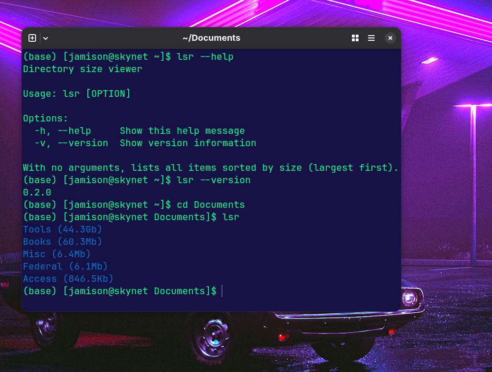

# LSR

A lightweight CLI tool made in Rust for browsing local files with recursive file sizing. 



## Motivation

I wanted a very simple CLI tool that I could use to check directory sizes rather than using more complex software just to check a folder size quickly. 

## Installation

### Prerequisites

- [Rust](https://www.rust-lang.org/tools/install)

### Build & Install For Linux

1. Clone the repository:
   ```bash
   git clone https://github.com/JamisonHunter/lsr

2. Navigate to your cloned directory and cd into lsr.
    ```bash
    cd lsr

3. Next build the release version with cargo.
    ```bash
    cargo build --release

4. Move the executable into your path to make it accessible via the terminal.
    ```bash
    sudo mv target/release/lsr /usr/local/bin/

5. Lastly, type 'lsr' into the terminal in order to check if it is working. 

## Planned Changes

* Loading bar for larger file trees. 
